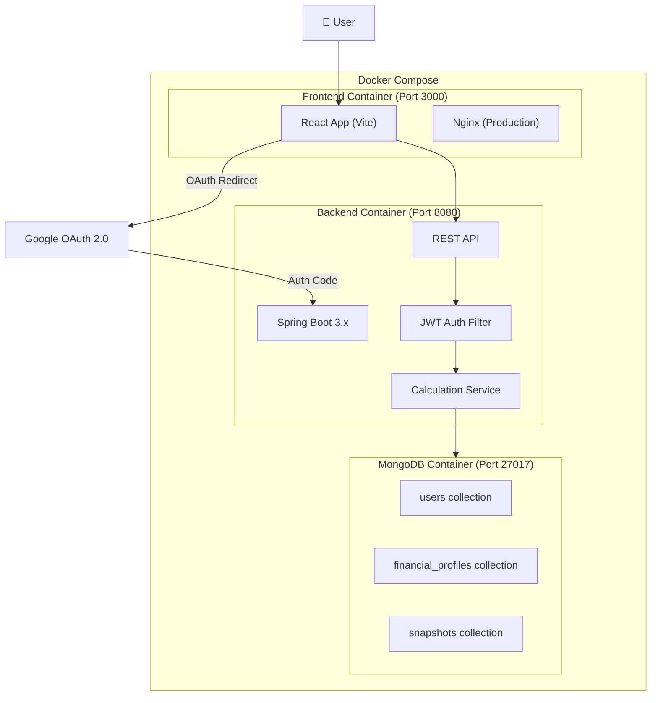
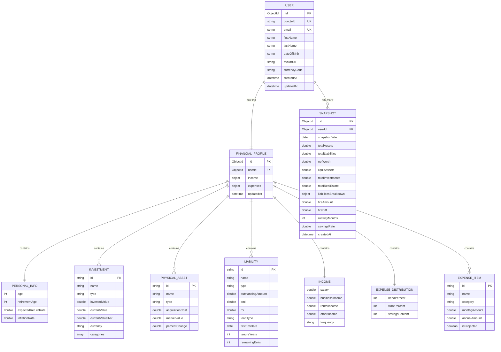

# Personal Net Worth Calculator — Architecture Document

## 1. Overview

A full-stack web application that helps users track their personal net worth, track investment categories (METALS, LIQUID, DOMESTIC, INTERNATIONAL), manage liabilities, budget expenses (using the Need/Want/Savings rule), and calculate F.I.R.E. (Financial Independence, Retire Early) goals — replacing the current Excel-based workflow.

### Reference: User's Excel Layout

The existing Excel tracker has six key sections that this app will replicate and enhance:

| Excel Section | App Equivalent |
|---|---|
| Asset Allocation (Ideal vs Current %) | Investment categories pie chart (METALS, LIQUID, DOMESTIC, INTERNATIONAL) |
| Investment Data (instrument-level) | Investments module with cost vs market value |
| Liability/Loans (EMI, ROI, tenure) | Loans module with amortization tracking |
| Expense Details (Need/Want/Savings 65/15/20) | Budget module with projected vs actuals |
| Asset Data (acquisition cost vs market value) | Physical Assets module with appreciation tracking |
| Summary Dashboard (Net Worth, FIRE, Runway) | Main Dashboard with charts and KPIs |
| — | User Profile (name, DOB, login email) |

---

## 2. Tech Stack

| Layer | Technology | Version |
|---|---|---|
| Frontend | React (Vite) | React 19, Vite 6 |
| UI Charts | Recharts | Latest |
| Styling | Tailwind CSS v4 | CSS-first config (`@theme`) |
| Backend | Java Spring Boot | 3.x (Java 21 LTS) |
| Build Tool | Maven | Latest |
| Database | MongoDB | 7.x |
| Authentication | Google OAuth 2.0 (via Spring Security) | — |
| Containerization | Docker + Docker Compose | — |

---

## 3. System Architecture



### Authentication Flow

1. User clicks "Sign in with Google" on the frontend
2. Frontend redirects to Google OAuth consent screen
3. Google returns authorization code to backend callback URL
4. Backend exchanges code for tokens, creates/updates user in MongoDB
5. Backend issues a JWT token to the frontend
6. Frontend stores JWT and sends it with every API request

---

## 4. Entity Relationship Diagram (ERD)



### ERD Notes

- **USER ↔ FINANCIAL_PROFILE**: One-to-one relationship. Each user has exactly one financial profile.
- **USER ↔ SNAPSHOT**: One-to-many. A user accumulates monthly snapshots for historical tracking.
- **FINANCIAL_PROFILE** embeds all sub-entities (investments, assets, liabilities, expenses) as nested arrays/objects within a single MongoDB document — this avoids JOINs and keeps reads fast.
- **INVESTMENT, PHYSICAL_ASSET, LIABILITY, EXPENSE_ITEM** each have a UUID `id` field for client-side identification and targeted CRUD operations within the embedded arrays.

---

## 5. Data Model (MongoDB Collections)

### 5.1 `users`

```json
{
  "_id": "ObjectId",
  "googleId": "string (unique)",
  "email": "string (unique)",
  "firstName": "string",
  "lastName": "string",
  "dateOfBirth": "string (YYYY-MM-DD)",
  "avatarUrl": "string",
  "currencyCode": "INR",
  "createdAt": "ISODate",
  "updatedAt": "ISODate"
}
```

### 5.2 `financial_profiles`

One document per user — the core financial data.

```json
{
  "_id": "ObjectId",
  "userId": "ObjectId (ref: users)",

  "personalInfo": {
    "age": 33,
    "retirementAge": 40,
    "expectedReturnRate": 12.0,
    "inflationRate": 6.0
  },


  "investments": [
    {
      "id": "uuid",
      "name": "Mutual funds",
      "type": "EQUITY",
      "investedValue": 3059347,
      "currentValue": 3502997,
      "currentValueINR": 3502997,
      "currency": "INR",
      "categories": ["DOMESTIC", "LIQUID"]
    },
    {
      "id": "uuid",
      "name": "NPS",
      "type": "RETIRALS",
      "investedValue": 1154709,
      "currentValue": 1289244,
      "currentValueINR": 1289244,
      "currency": "INR",
      "categories": ["DOMESTIC"]
    },
    {
      "id": "uuid",
      "name": "US Equity Fund",
      "type": "EQUITY",
      "investedValue": 9988,
      "currentValue": 9988,
      "currentValueINR": 948243,
      "currency": "USD",
      "categories": ["INTERNATIONAL", "LIQUID"]
    }
  ],

  "physicalAssets": [
    {
      "id": "uuid",
      "name": "Ganga Kalash (Flat)",
      "type": "REAL_ESTATE",
      "acquisitionCost": 4600000,
      "marketValue": 7500000,
      "percentChange": 63.0
    },
    {
      "id": "uuid",
      "name": "Farm (Land)",
      "type": "REAL_ESTATE",
      "acquisitionCost": 1200000,
      "marketValue": 1200000,
      "percentChange": 0.0
    }
  ],

  "liabilities": [
    {
      "id": "uuid",
      "name": "BoI",
      "type": "HOME_LOAN",
      "outstandingAmount": 9650297,
      "emi": 76432,
      "roi": 7.1,
      "loanType": "OD",
      "firstEmiDate": "2025-11-21",
      "tenureYears": 20,
      "remainingEmis": 233
    },
    {
      "id": "uuid",
      "name": "HSBC 220",
      "type": "HOME_LOAN",
      "outstandingAmount": 1842780,
      "emi": 22022,
      "roi": 7.25,
      "loanType": "REGULAR",
      "firstEmiDate": null,
      "tenureYears": null,
      "remainingEmis": null
    }
  ],

  "income": {
    "salary": 588260,
    "businessIncome": 0,
    "rentalIncome": 0,
    "otherIncome": 0,
    "frequency": "MONTHLY"
  },

  "expenses": {
    "distribution": {
      "needPercent": 65,
      "wantPercent": 15,
      "savingsPercent": 20
    },
    "items": [
      {
        "id": "uuid",
        "name": "Home Loan EMI",
        "category": "NEED",
        "monthlyAmount": 126389,
        "annualAmount": 1516660,
        "isProjected": true
      },
      {
        "id": "uuid",
        "name": "CAR + Driver",
        "category": "NEED",
        "monthlyAmount": 100000,
        "annualAmount": 1200000,
        "isProjected": true
      },
      {
        "id": "uuid",
        "name": "Groceries",
        "category": "NEED",
        "monthlyAmount": 21000,
        "annualAmount": 252000,
        "isProjected": true
      },
      {
        "id": "uuid",
        "name": "Travel",
        "category": "WANT",
        "monthlyAmount": 0,
        "annualAmount": 100000,
        "isProjected": true
      }
    ],
    "actuals": {
      "monthlyTotal": 0,
      "annualTotal": 0,
      "items": []
    }
  },

  "updatedAt": "ISODate"
}
```

### 5.3 `snapshots` (for historical tracking)

Monthly snapshots for net worth over time chart.

```json
{
  "_id": "ObjectId",
  "userId": "ObjectId (ref: users)",
  "snapshotDate": "ISODate",
  "totalAssets": 32837412,
  "totalLiabilities": 13555512,
  "netWorth": 32837412,
  "liquidAssets": 7733096,
  "totalInvestments": 16447513,
  "totalRealEstate": 20500000,
  "totalLiabilitiesBreakdown": {
    "homeLoans": 13555512,
    "personalLoans": 0,
    "otherDebts": 0
  },
  "fireAmount": 62340000,
  "fireDiff": 29502588,
  "runwayMonths": 48,
  "savingsRate": 26.7,
  "createdAt": "ISODate"
}
```

---

## 6. API Design (REST Endpoints)

### 6.1 Authentication

| Method | Endpoint | Description |
|---|---|---|
| GET | `/api/auth/google` | Initiate Google OAuth login |
| GET | `/api/auth/google/callback` | Google OAuth callback |
| POST | `/api/auth/logout` | Logout and invalidate session |
| GET | `/api/auth/me` | Get current user info |

### 6.2 User Profile & Settings

| Method | Endpoint | Description |
|---|---|---|
| GET | `/api/users/profile` | Get user profile (name, DOB, email, avatar) |
| PUT | `/api/users/profile` | Update first name, last name, DOB |
| PUT | `/api/users/settings` | Update currency code (ISO 4217), age, retirement age, expected return rate, inflation rate |

### 6.3 Financial Profile

| Method | Endpoint | Description |
|---|---|---|
| GET | `/api/profile` | Get full financial profile |
| POST | `/api/profile/investments` | Add an investment |
| PUT | `/api/profile/investments/{id}` | Update an investment |
| DELETE | `/api/profile/investments/{id}` | Delete an investment |
| POST | `/api/profile/physical-assets` | Add a physical asset |
| PUT | `/api/profile/physical-assets/{id}` | Update a physical asset |
| DELETE | `/api/profile/physical-assets/{id}` | Delete a physical asset |
| POST | `/api/profile/liabilities` | Add a liability/loan |
| PUT | `/api/profile/liabilities/{id}` | Update a liability/loan |
| DELETE | `/api/profile/liabilities/{id}` | Delete a liability/loan |
| PUT | `/api/profile/income` | Update income details |
| PUT | `/api/profile/expenses/distribution` | Update Need/Want/Savings % split |
| POST | `/api/profile/expenses/items` | Add an expense item |
| PUT | `/api/profile/expenses/items/{id}` | Update an expense item |
| DELETE | `/api/profile/expenses/items/{id}` | Delete an expense item |

### 6.4 Dashboard / Calculations

| Method | Endpoint | Description |
|---|---|---|
| GET | `/api/dashboard/summary` | Computed summary (net worth, FIRE, runway, etc.) |

### 6.5 Snapshots (Historical)

| Method | Endpoint | Description |
|---|---|---|
| POST | `/api/snapshots` | Take a manual snapshot of current state |
| GET | `/api/snapshots` | Get all snapshots (for net worth over time chart) |
| GET | `/api/snapshots/latest` | Get most recent snapshot |

---

## 7. Calculation Logic

### 7.1 Total Assets

```
Total Assets = Sum(all investment currentValues) + Sum(all physicalAsset marketValues)
```

### 7.2 Total Liabilities

```
Total Liabilities = Sum(all liability outstandingAmounts)
```

### 7.3 Net Worth

```
Net Worth = Total Assets - Total Liabilities
```

### 7.4 Liquid Assets

Liquid assets include investments tagged with the LIQUID category:

```
Liquid Assets = Sum(currentValueINR) where investment.categories contains LIQUID
```

> **Note**: Investments tagged as RETIRALS (NPS, EPF) should typically not be tagged LIQUID since they are locked until retirement.

### 7.5 Income & Savings (Per Annum)

```
Income PA = (Monthly Salary + Business Income + Rental Income + Other Income) × 12
Savings PA = Income PA - Total Expenses PA
Basic Expense PA = Sum(expense items where category = NEED, annualized)
```

### 7.6 Emergency Surplus / Deficit

```
Emergency Fund Target = Monthly Expenses × 6  (6 months of expenses)
Emergency Surplus/Deficit = Liquid Assets - Emergency Fund Target
```

### 7.7 Runway (Preparedness for Loss of Income)

```
Monthly Expenses = Sum(all expense items, annualized) / 12
Runway (months) = Liquid Assets ÷ Monthly Expenses
Runway (years) = Runway (months) ÷ 12
```

### 7.8 F.I.R.E. Amount (25x Rule)

```
Annual Expenses = Sum(all expense items, annualized) - Sum(expense items where category = SAVINGS)
FIRE Amount = Annual Expenses × 25
FIRE Diff = FIRE Amount - Net Worth
```

### 7.9 Years to FIRE

```
Monthly Investment = Total monthly savings (from expenses categorized as SAVINGS)
Real Rate of Return = ((1 + expectedReturnRate) / (1 + inflationRate)) - 1

Using Future Value of Annuity formula:
FV = PMT × [((1 + r)^n - 1) / r]

Where:
  FV = FIRE Diff (amount still needed)
  PMT = Monthly Investment
  r = Real Rate of Return (monthly)

Solve for n (months), then convert to years.
```

### 7.10 Retirement Countdown

Retirement age is configurable via the Dashboard (quick edit) or Settings page:

```
Retirement (months left) = (Retirement Age - Current Age) × 12
```

### 7.11 Investment Category Breakdown

```
For each category in [METALS, LIQUID, DOMESTIC, INTERNATIONAL]:
  Category Value = Sum(currentValueINR) where investment.categories contains category
  Category % = Category Value / Total Investment Value × 100

Note: An investment can belong to multiple categories (e.g., DOMESTIC + LIQUID),
so category totals may exceed total investment value.
```

---

## 8. Frontend Architecture

### 8.1 Project Structure

```
frontend/
├── public/
├── src/
│   ├── assets/              # Static assets, fonts
│   ├── components/
│   │   ├── common/          # Button, Input, Card, Modal, Toggle
│   │   ├── charts/          # PieChart, BarChart, GaugeChart, LineChart
│   │   ├── layout/          # Navbar, Sidebar, Footer, PageContainer
│   │   └── forms/           # InvestmentForm, LoanForm, ExpenseForm, etc.
│   ├── pages/
│   │   ├── LoginPage.jsx
│   │   ├── DashboardPage.jsx
│   │   ├── InvestmentsPage.jsx
│   │   ├── AssetsPage.jsx
│   │   ├── LiabilitiesPage.jsx
│   │   ├── BudgetPage.jsx
│   │   ├── ProfilePage.jsx
│   │   └── SettingsPage.jsx
│   ├── hooks/               # useAuth, useProfile, useDashboard, useTheme
│   ├── context/             # AuthContext, ThemeContext
│   ├── services/            # api.js (Axios instance), auth.js, profile.js
│   ├── utils/               # formatCurrency, calculations, constants
│   ├── App.jsx
│   ├── App.css              # Tailwind v4 @theme tokens + custom styles
│   └── main.jsx
├── Dockerfile
├── nginx.conf
├── package.json
└── vite.config.js
```

### 8.2 Tailwind CSS v4 Theme Configuration

Tailwind v4 uses CSS-first configuration with `@theme` directive:

```css
/* App.css */
@import "tailwindcss";

@theme {
  /* Gold accent palette */
  --color-accent: #D4A017;
  --color-accent-hover: #B8860B;
  --color-accent-light: #F0C040;
  --color-accent-glow: #FFD700;

  /* Semantic colors */
  --color-success: #10B981;
  --color-danger: #EF4444;
  --color-warning: #F59E0B;

  /* Surface colors (light mode defaults) */
  --color-surface-primary: #FFFFFF;
  --color-surface-secondary: #F8F9FA;
  --color-surface-card: #FFFFFF;

  /* Text colors */
  --color-text-primary: #1A1D27;
  --color-text-secondary: #6B7280;

  /* Border */
  --color-border: #E5E7EB;

  /* Border radius */
  --radius-card: 12px;
  --radius-input: 8px;

  /* Font */
  --font-sans: 'Inter', sans-serif;
}

/* Dark mode overrides */
@media (prefers-color-scheme: dark) {
  :root {
    --color-surface-primary: #0F1117;
    --color-surface-secondary: #1A1D27;
    --color-surface-card: #1E2130;
    --color-text-primary: #F0F0F5;
    --color-text-secondary: #9CA3AF;
    --color-border: #2D3148;
    --color-accent: #F0C040;
    --color-accent-hover: #FFD700;
  }
}

/* Also support manual toggle via data attribute */
[data-theme="dark"] {
  --color-surface-primary: #0F1117;
  --color-surface-secondary: #1A1D27;
  --color-surface-card: #1E2130;
  --color-text-primary: #F0F0F5;
  --color-text-secondary: #9CA3AF;
  --color-border: #2D3148;
  --color-accent: #F0C040;
  --color-accent-hover: #FFD700;
}
```

### 8.3 Pages & Layout

#### Dashboard Page (Home)

The primary view — replicates and enhances the Excel "Summary" section.
Includes an **inline-editable Retirement Age** field for quick adjustments.

```
┌─────────────────────────────────────────────────────────┐
│  Navbar [Logo] [Dashboard|Investments|Assets|...]  [🌙] │
├─────────────────────────────────────────────────────────┤
│                                                         │
│  ┌──────────┐ ┌──────────┐ ┌──────────┐ ┌──────────┐   │
│  │ Net Worth│ │ Income PA│ │Savings PA│ │ Runway   │   │
│  │₹3.28 Cr  │ │₹74.7 L   │ │₹19.9 L   │ │ 4 Years  │   │
│  └──────────┘ └──────────┘ └──────────┘ └──────────┘   │
│                                                         │
│  ┌─────────────────────────┐ ┌────────────────────────┐ │
│  │  Net Worth Over Time    │ │  Investment Categories │ │
│  │  (Line Chart)           │ │  (Pie Chart)           │ │
│  │  📈                     │ │  🥧 DOMESTIC/INTL/     │ │
│  └─────────────────────────┘ │     METALS/LIQUID       │ │
│                               └────────────────────────┘ │
│                                                         │
│  ┌─────────────────────────┐ ┌────────────────────────┐ │
│  │  F.I.R.E. Progress     │ │  Expense Breakdown     │ │
│  │  (Gauge / Progress)    │ │  Need/Want/Savings     │ │
│  │  ₹6.23Cr target        │ │  (Stacked Bar)         │ │
│  │  53% achieved          │ │                        │ │
│  │                        │ │                        │ │
│  │  Retire at: [40] ✏️    │ │                        │ │
│  │  62 months left        │ │                        │ │
│  └─────────────────────────┘ └────────────────────────┘ │
│                                                         │
└─────────────────────────────────────────────────────────┘
```

#### Profile Page (NEW)
- Google avatar, first name, last name, date of birth
- Email (read-only, from Google)
- Editable fields: first name, last name, DOB

#### Investments Page
- Table of all investments (name, type, invested value, current value, currency, gain/loss %)
- Add/Edit/Delete investment modal
- Subtotals by category (METALS, LIQUID, DOMESTIC, INTERNATIONAL)
- Investment categories pie chart

#### Assets Page (Physical Assets)
- Table of real estate, vehicles, jewelry, etc.
- Acquisition cost vs market value with % change
- Add/Edit/Delete asset modal

#### Liabilities Page
- Table of all loans (name, outstanding, EMI, ROI, type, tenure, remaining EMIs)
- Add/Edit/Delete loan modal
- Total EMI per month, total outstanding

#### Budget Page
- Need/Want/Savings distribution settings (65/15/20 configurable)
- Expense items table with category, monthly, annual amounts
- Projected vs Actuals comparison
- Income details section

#### Settings Page
- Personal info (age, retirement age, expected return, inflation rate)
- Currency code preference (ISO 4217, e.g. INR, USD) — symbol rendered by frontend via Intl API
- Theme toggle (light/dark)

---

## 9. Backend Architecture

### 9.1 Project Structure

```
backend/
├── src/main/java/com/networth/
│   ├── NetworthApplication.java
│   ├── config/
│   │   ├── SecurityConfig.java          # Spring Security + OAuth2
│   │   ├── CorsConfig.java
│   │   ├── MongoConfig.java
│   │   └── JwtConfig.java
│   ├── controller/
│   │   ├── AuthController.java
│   │   ├── UserController.java
│   │   ├── ProfileController.java
│   │   ├── DashboardController.java
│   │   └── SnapshotController.java
│   ├── service/
│   │   ├── AuthService.java
│   │   ├── ProfileService.java
│   │   ├── CalculationService.java       # All financial calculations
│   │   ├── SnapshotService.java
│   │   └── UserService.java
│   ├── model/
│   │   ├── User.java
│   │   ├── FinancialProfile.java
│   │   ├── Snapshot.java
│   │   ├── embedded/
│   │   │   ├── PersonalInfo.java
│   │   │   ├── Investment.java
│   │   │   ├── PhysicalAsset.java
│   │   │   ├── Liability.java
│   │   │   ├── Income.java
│   │   │   ├── Expenses.java
│   │   │   ├── ExpenseDistribution.java
│   │   │   └── ExpenseItem.java
│   │   └── dto/
│   │       ├── UserProfileDto.java
│   │       ├── DashboardSummaryDto.java
│   │       ├── InvestmentDto.java
│   │       ├── LiabilityDto.java
│   │       └── ExpenseDto.java
│   ├── repository/
│   │   ├── UserRepository.java
│   │   ├── FinancialProfileRepository.java
│   │   └── SnapshotRepository.java
│   ├── security/
│   │   ├── JwtTokenProvider.java
│   │   ├── JwtAuthenticationFilter.java
│   │   └── OAuth2SuccessHandler.java
│   └── exception/
│       ├── GlobalExceptionHandler.java
│       └── ResourceNotFoundException.java
├── src/main/resources/
│   ├── application.yml
│   └── application-dev.yml
├── Dockerfile
└── pom.xml
```

### 9.2 Key Dependencies (pom.xml)

```xml
<!-- Core -->
spring-boot-starter-web
spring-boot-starter-data-mongodb
spring-boot-starter-security
spring-boot-starter-oauth2-client
spring-boot-starter-validation

<!-- JWT -->
io.jsonwebtoken:jjwt-api:0.12.x
io.jsonwebtoken:jjwt-impl:0.12.x
io.jsonwebtoken:jjwt-jackson:0.12.x

<!-- Utility -->
org.projectlombok:lombok
org.springdoc:springdoc-openapi-starter-webmvc-ui  (Swagger UI)

<!-- Test -->
spring-boot-starter-test
de.flapdoodle.embed:de.flapdoodle.embed.mongo.spring3x
```

---

## 10. Docker Setup

### 10.1 docker-compose.yml

```yaml
version: '3.8'

services:
  frontend:
    build: ./frontend
    ports:
      - "3000:80"
    depends_on:
      - backend
    environment:
      - VITE_API_BASE_URL=http://localhost:8080/api

  backend:
    build: ./backend
    ports:
      - "8080:8080"
    depends_on:
      - mongodb
    environment:
      - SPRING_DATA_MONGODB_URI=mongodb://mongodb:27017/networth
      - GOOGLE_CLIENT_ID=${GOOGLE_CLIENT_ID}
      - GOOGLE_CLIENT_SECRET=${GOOGLE_CLIENT_SECRET}
      - JWT_SECRET=${JWT_SECRET}
      - FRONTEND_URL=http://localhost:3000

  mongodb:
    image: mongo:7
    ports:
      - "27017:27017"
    volumes:
      - mongo-data:/data/db

volumes:
  mongo-data:
```

### 10.2 Frontend Dockerfile

```dockerfile
# Build stage
FROM node:22-alpine AS build
WORKDIR /app
COPY package*.json ./
RUN npm ci
COPY . .
RUN npm run build

# Production stage
FROM nginx:alpine
COPY --from=build /app/dist /usr/share/nginx/html
COPY nginx.conf /etc/nginx/conf.d/default.conf
EXPOSE 80
```

### 10.3 Backend Dockerfile

```dockerfile
FROM eclipse-temurin:21-jdk-alpine AS build
WORKDIR /app
COPY pom.xml .
COPY .mvn .mvn
COPY mvnw .
RUN chmod +x mvnw
RUN ./mvnw dependency:go-offline
COPY src ./src
RUN ./mvnw clean package -DskipTests

FROM eclipse-temurin:21-jre-alpine
WORKDIR /app
COPY --from=build /app/target/*.jar app.jar
EXPOSE 8080
ENTRYPOINT ["java", "-jar", "app.jar"]
```

---

## 11. Security Considerations

1. **All API endpoints** (except `/api/auth/*`) require a valid JWT token
2. **CORS** configured to allow only the frontend origin
3. **Input validation** using Jakarta Bean Validation on all DTOs
4. **MongoDB injection prevention** via Spring Data MongoDB (parameterized queries)
5. **JWT tokens** expire after 24 hours; refresh token support can be added later
6. **Environment secrets** stored in `.env` file (not committed to git)

---

## 12. Responsive Design Strategy

| Breakpoint | Layout |
|---|---|
| `≥ 1200px` (Desktop) | 2-column dashboard, sidebar navigation |
| `768px – 1199px` (Tablet) | 2-column dashboard, collapsible sidebar |
| `< 768px` (Mobile) | Single column, bottom navigation bar, stacked cards |

- All tables become scrollable cards on mobile
- Charts resize responsively using Recharts' `ResponsiveContainer`
- Touch-friendly input controls (larger tap targets)
- Tailwind v4 responsive utilities (`sm:`, `md:`, `lg:`, `xl:`)

---

## 13. Phased Implementation Plan

### Phase 1 — Foundation (Backend + Auth + Basic Frontend)

1. Initialize Spring Boot project with MongoDB, Security, OAuth2
2. Implement User model (with firstName, lastName, DOB), Google OAuth login flow, JWT
3. Initialize React (Vite) project with Tailwind CSS v4 and design tokens
4. Build Login page with Google Sign-In
5. Set up Docker Compose with all 3 services
6. Verify end-to-end: Login → JWT → Protected API call

### Phase 2 — Core Data Entry (CRUD)

1. Financial Profile model & repository (all embedded entities)
2. CRUD APIs for investments, physical assets, liabilities, income, expenses
3. React forms for each data section (Investments, Assets, Loans, Budget)
4. Profile page (first name, last name, DOB)
5. Settings page (personal info, currency, theme)

### Phase 3 — Dashboard & Calculations

1. CalculationService (net worth, FIRE, runway, category breakdowns)
2. Dashboard Summary API
3. Dashboard page with KPI cards
4. Charts: Investment Categories Pie, Expense Breakdown Bar, FIRE Gauge
6. Inline-editable Retirement Age on dashboard

### Phase 4 — Historical Tracking & Polish

1. Snapshot model & APIs
2. Net Worth Over Time line chart
3. Monthly auto-snapshot (Spring `@Scheduled`)
4. Light/Dark theme toggle with Tailwind dark mode
5. Responsive polish for mobile
6. Error handling, loading states, empty states
